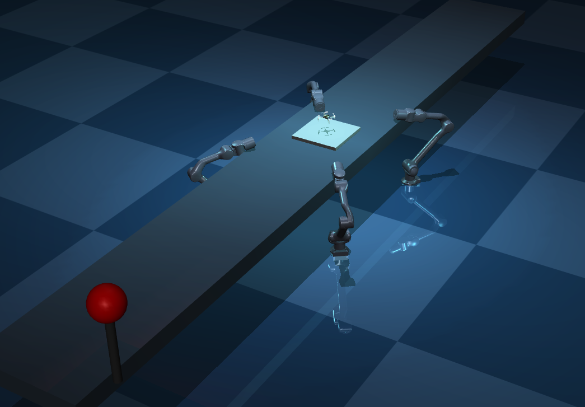
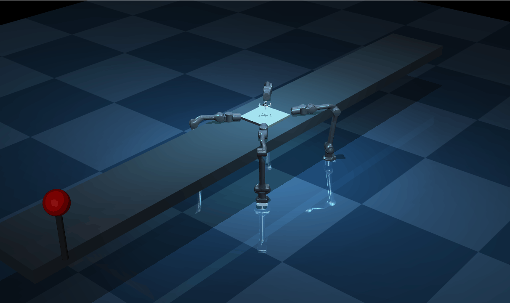

# MuJoCo 无人机工业自动化产线仿真 (Drone Assembly Line Simulation)
## 📖 项目概述
本项目基于 MuJoCo 物理引擎，构建了一个高度自动化的无人机（Crazyflie 2.1）生产产线。仿真场景集成了四个 Unitree Z1 机械臂、一条可移动的传送带以及带有视觉反馈的工业警示灯系统。

Unitree Z1 机械臂：

Crazyflie 2.1：

### 核心脚本：
通过 main.py 脚本，项目实现了从模型动态合并（XML 注入）、工业材质渲染到多模式生产逻辑的完整流程。
### 核心功能多模式切换：
支持运输 (Transport)、装配 (Assembly)、检测 (Scanning) 和待机 (Home) 四种工业状态。
### 动态 XML 构建：
自动解析并合并 z1.xml 与 cf2.xml，通过代码注入解决命名空间冲突并增强视觉效果。
### 平滑控制：采用低通滤波技术实现机械臂多自由度协同作业的平滑过渡。
### 环境渲染：赛博朋克风格灯光设计，包含动态变换颜色的红/蓝 LED 警示灯。
## 🛠 运行环境配置
### 系统要求MuJoCo: 2.3.3 或更高版本（必须支持 implicitfast 积分器）。
### 操作系统: Windows, macOS, 或 Linux。
### Python: 3.8 - 3.11。2. 依赖安装建议在虚拟环境中运行。
### 您需要安装 mujoco 及其内置的渲染器支持：Bashpip install mujoco numpy
### 文件结构确保以下文件处于同一根目录下：
    ./
      main.py: 主程序脚本;
      z1.xml：Unitree Z1 机械臂描述文件；
      cf2.xml: Crazyflie 2.1 无人机描述文件。
      /assets: 存放所有 .stl (Z1) 和 .obj (CF2) 网格文件的文件夹。
## 🚀 具体使用步骤
### 1. 基础环境配置
打开终端（CMD 或 PowerShell），执行以下命令安装必要的 Python 包：
### 安装 MuJoCo 核心库及查看器（必须）
    pip install mujoco mujoco-viewer numpy
注意：根据项目代码要求，MuJoCo 版本必须大于 2.3.3。
这个项目不需要安装任何复杂的外部软件（如 Unity 或特定的桌面版客户端），它完全运行在 Python 环境中。你只需要确保安装了 Python 的物理引擎库 mujoco 即可。

以下是针对你手头文件的具体使用步骤：

1. 基础环境配置
打开终端（CMD 或 PowerShell），执行以下命令安装必要的 Python 包：

Bash
# 安装 MuJoCo 核心库及查看器（必须）
pip install mujoco mujoco-viewer numpy
注意：根据项目代码要求，MuJoCo 版本必须大于 2.3.3。

### 2. 准备文件（至关重要）
main.py 会动态读取并组合模型文件，如果文件位置不对，程序会立刻报错。请确保你的文件夹长这样：
main.py (主运行脚本)
z1.xml (机械臂模型)
cf2.xml (无人机模型)
assets/ (文件夹) —— 这里必须存放所有的模型零件文件（如 .stl 和 .obj 格式的文件）。

### 3. 如何启动
在终端进入该文件夹路径，运行：
      python main.py

### 4. 运行中的交互控制
程序启动后，会弹出一个 3D 仿真窗口。你可以通过键盘的数字键来手动控制生产线的状态：

为什么报错？ > 脚本中的 XML 会去 assets/ 目录下找零件，如果没有这个文件夹，或者零件不在里面，你会看到 File not found 的错误。

运行指南直接运行 Python 脚本，程序将自动生成 scene_final.xml 并启动可视化窗口：Bashpython main.py
## 交互控制键在仿真窗口激活状态下，通过键盘按键实时切换产线状态：
[9] 重置运输：将无人机 carrier 移回起点并重新运入产线。
[1] 装配模式：四个机械臂同步执行垂直拾取与放置动作。
[2] 检测模式：机械臂执行扇形摆动扫描，模拟视觉质量检测。
[0] 待机模式：机械臂收缩至安全位，产线停止。
## 🏗 技术细节
### 自动化布局:
脚本通过 Euler 角计算，使四个机械臂默认朝向传送带中心点 $(0,0)$：L1/L2: 位于 $y = -0.35$ 侧，负责左侧装配。R1/R2: 位于 $y = 0.35$ 侧，负责右侧装配。
### 工业材质注入:
项目在合并过程中动态添加了以下材质：robot_metal: 深空灰高反射金属（用于机械臂）。conveyor_mat: 工业蓝灰磨砂材质（用于传送带）。grid: 科技感方格地面。
### 警示灯逻辑:
警示灯通过动态修改 model.light_diffuse 和 model.geom_rgba 实现。它以 $1.0\text{s}$ 为周期在红色与蓝色之间闪烁，同步模拟光源投射和灯泡自发光效果。

## 🎖️ 效果展示
静态展示：

动态效果：

## 🙏 致谢
项目基于 Unitree Z1 和 Crazyflie 2.1 模型，并参考了 Bitcraze 的开源模型。
模型作者：Unitree Robotics, Bitcraze.

## 🔝 开源说明
模型已开源与GitHub，欢迎 fork与star！
[链接] https://github.com/chensiqi2007/study-2026-winter-holiday/tree/main/OH%E5%BB%BA%E6%A8%A1

## 📄 许可说明
Unitree Z1: 遵循 BSD-3-Clause 协议。
Crazyflie 2.1: 参考 Bitcraze 开源模型。
仿真框架: 基于 MuJoCo 官方推荐标准构建。
